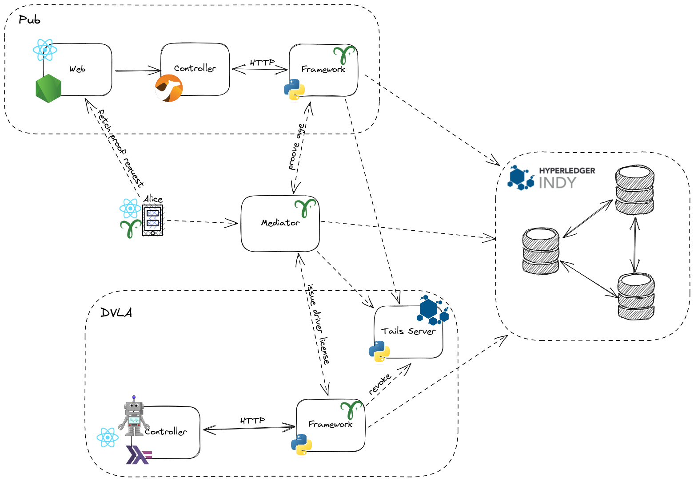

# Driver and Vehicle Licensing Agency DIDs

Personal learning POC project to practice DIDs and Hyperledger Aries. No production usage intended.

## Overview


[Excalidraw source](./diagram.excalidraw)

### Players:

1. DVLA

   - issues and revokes driver licenses

2. Alice

   - receives and holds her driver license

3. Pub

   - verifies Alice age using driver license

### Repo structure:

1. [dvla](./dvla/) - DVLA organization controller
2. [framework-stub](./framework-stub/) - stub for ACA-Py (used for local testing)
3. [network](./network/) - files for local network
4. [pub](./pub) - Pub organization controller

## Local setup

1. Set environment variables in `.env` file. See instructions for each variable there.

2. Build Indy Tails Server:

```shell
git clone https://github.com/bcgov/indy-tails-server
cd indy-tails-server
docker build . -t bcgovimages/tails-server -f docker/Dockerfile.tails-server
```

3. Start DVLA network: `docker compose up`.

4. Connect Alice mobile device to DVLA network. Theoretically should work with different mobile agents,
   but was actually tested with Aries Bifold agent. Follow instructions for Aries Bifold setup in their [repo](https://github.com/hyperledger/aries-mobile-agent-react-native).
   - Set `MEDIATOR_URL` to Indicio public mediator invitation from [here](https://indicio-tech.github.io/mediator/).
   - Set `GENESIS_URL` to BCovrin Test (http://test.bcovrin.vonx.io/genesis)

## Usage

1. Go to DVLA UI on `localhost:8002`. Generate Invitation and scan QR with Aries Bifold.

2. Send message from Bifold to DVLA: In Bifold go to contacts, newest contact should be `DVLA Agent`.
   Send some message. You should see message in controller logs.

3. For following examples to work set: `CONNECTION_ID=e291815e-c58d-4d36-90ed-6a6cc63c23ca`.
   To find `connectionId` either check controller logs or issue `curl localhost:8002/api/connections`.

4. Send message from DVLA to Bifold: Issue `curl -i -X POST -H "Content-Type: application/json" -d '{"connectionId": "'$CONNECTION_ID'", "text": "Hello!"}' localhost:8002/api/messages` to send "Hello!".

5. Create schema and credential definition for driver license: `curl -i -X POST localhost:8002/api/schemas`.

6. Issue driver license to mobile agent:
   `curl -i -X POST -H "Content-Type: application/json" -d '{"connectionId": "'$CONNECTION_ID'", "attributes": {"firstName": "Alice", "lastName": "Doe", "category":"B1", "dateOfBirth": "19891109"}}' localhost:8002/api/licenses`.
   You should see credential offer in Bifold. Accept it.

7. Go to Pub UI at `localhost:8013`. Generate proof request and scan it with Bifold.
   You should be able to prove your name and age using fresh driver license.

8. To revoke license issue: `curl -i -X DELETE localhost:8002/api/licenses/$CONNECTION_ID`. After this you could try to prove your age one more time, but it should not be possible since credential is revoked.
